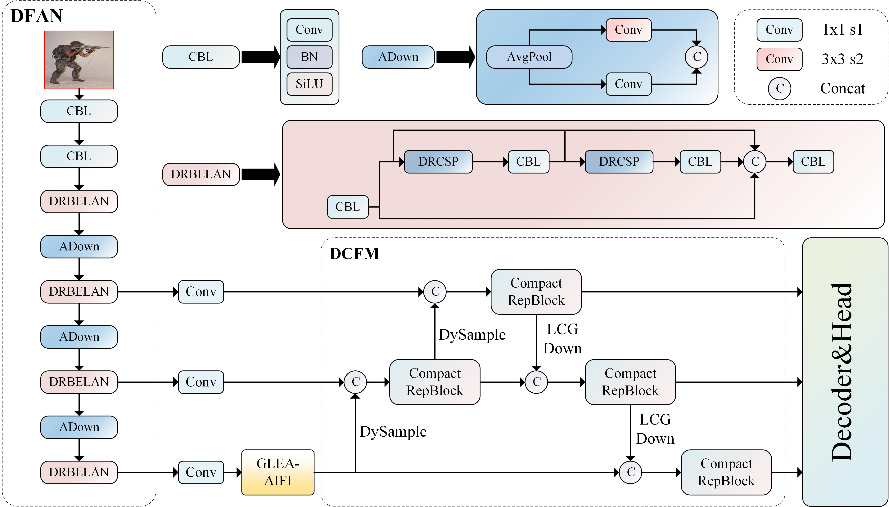

# FG-DETR
FG-DETR is a fine-grained detection algorithm based on RT-DETR.

  
  
<strong>Figure 1:</strong> The overviwer of FG-DETR.

  
  <strong>Figure 1:</strong> The overviwer of FG-DETR.

The code is coming soon.
